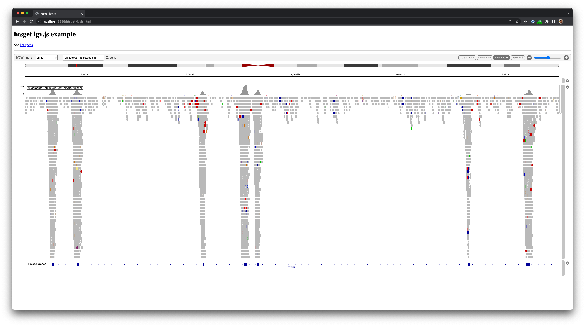
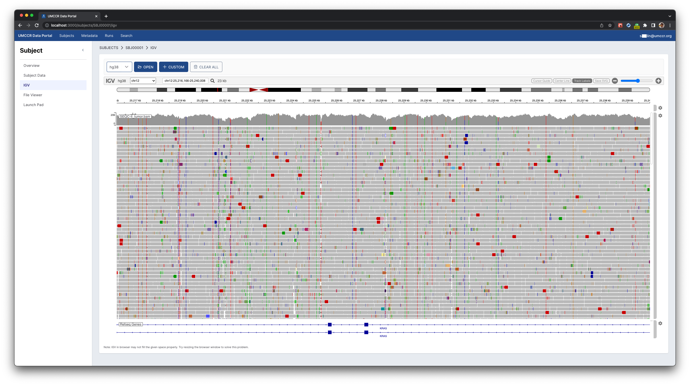

# How to Htsget and IGV.js

You can start local htsget server as follows:

```
export AWS_PROFILE=dev
sh htsget-rs.sh
```

```
curl -s 'http://localhost:3100/reads/service-info' | jq
```

```
curl -s 'http://localhost:3100/variants/service-info' | jq
```


## Example Data

You can drop some BAM and VCF into respective folder. 

Note that we shall ignore everything except `.placeholder` file.

Perhaps, grab some from:
- https://github.com/umccr/htsget-rs/tree/main/data
- https://github.com/ga4gh/htsget-refserver/tree/develop/data


```shell
wget https://raw.githubusercontent.com/umccr/htsget-rs/main/data/bam/htsnexus_test_NA12878.bam -O ./data/bam/htsnexus_test_NA12878.bam
wget https://raw.githubusercontent.com/ga4gh/htsget-refserver/develop/data/test/sources/giab/HG002_GIAB.filtered.vcf.gz -O ./data/vcf/HG002_GIAB.filtered.vcf.gz
```

```shell
samtools index ./data/bam/htsnexus_test_NA12878.bam
bcftools index --tbi ./data/vcf/HG002_GIAB.filtered.vcf.gz
```

## Dry Run

```shell
python3 -m http.server 8888 --directory .
```

- Go to http://localhost:8888/htsget-igvjs.html

## Endpoint

```
curl -s 'http://localhost:3100/reads/local/bam/htsnexus_test_NA12878' | jq
```

```
curl -s 'http://localhost:3100/variants/local/vcf/HG002_GIAB.filtered' | jq
```

_(from remote umccr dev bucket)_

```
curl -s 'http://localhost:3100/reads/umccr-research-dev/validation_data_dragen/SEQC50/SEQC-II_tumor' | jq
```

## Caveats

_NOTE 1: how it map bucket and key to htsget ID_

```
export AWS_PROFILE=dev
aws s3 ls s3://umccr-research-dev/validation_data_dragen/SEQC50/SEQC-II_tumor.bam
```

_NOTE 2: UnauthorizedException: Session token not found or invalid_

If you find `UnauthorizedException: Session token not found or invalid` in htsget-rs server log then `aws sso login` again.

## Demo

You are expected to observe as follows.



_(Use "Custom" button to load from S3)_


